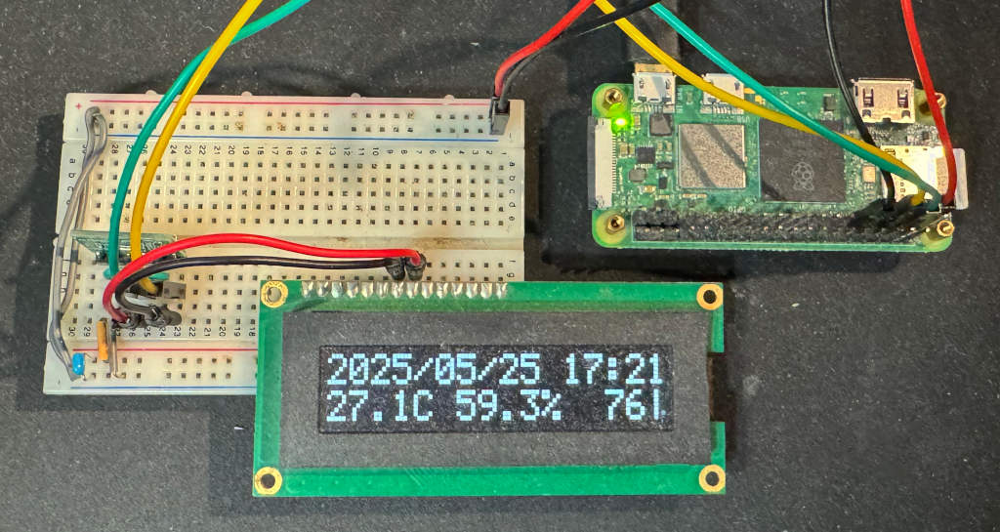

# WBoker-rs

[Raspberry Pi Zero 2 W](https://www.raspberrypi.com/products/raspberry-pi-zero-2-w/) や [SO1602A](http://akizukidenshi.com/catalog/g/g108277/)、[BME280](https://www.bosch-sensortec.com/media/boschsensortec/downloads/datasheets/bst-bme280-ds002.pdf)を利用した温湿度計のソフトウエアです。



## 利用しているハードウエア購入先

- [Raspberry Pi Zero 2 W](https://www.switch-science.com/products/7600?srsltid=AfmBOopQQr14qMohoXSYehaF6GaQbh14SGAu1B1mE3657LrqBvF2u5Cr)
- [有機 EL キャラクターディスプレイモジュール 16×2 行 白色](http://akizukidenshi.com/catalog/g/g108277/)
- [BME280 使用 温湿度・気圧センサーモジュールキット](https://akizukidenshi.com/catalog/g/g109421/)

## コンパイルに必要なソフトウエア

- Docker
- Rust

本プロジェクトは、Raspberry Pi Zero 2 用にクロスコンパイルできます。

## クイックスタート

1. ハードウエアを構築します。（設計図は後ほど公開予定）
2. Raspberry Pi Zero 2 に Raspberry Pi OS をインストールします。
3. 本リポジトリをクローンして、ビルドします。
   ```sh
   cd wbroker-rs
   make
   ```
4. `dist`ディレクトリに作成された `wbroker-rs.tar.gz` を Raspberry Pi Zero 2 にアップロードします。
5. Raspberry Pi Zero 2 にログインして、`wbroker-rs.tar.gz`を展開します。
6. 以下のコマンドを入力して、インストールします。
   ```sh
   cd wbroker-rs
   make install
   ```
7. 以下のコマンドで入力して、サービスを開始します。
   ```sh
   sudo systemctl start wbroker-rs
   ```
8. SO1602A に今日の日付と温湿度が表示されることを確認します。

## ライセンス(License)

MIT
